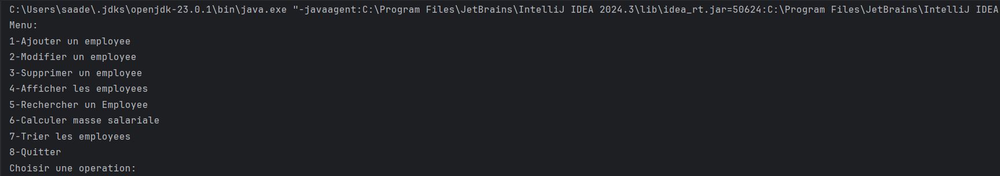
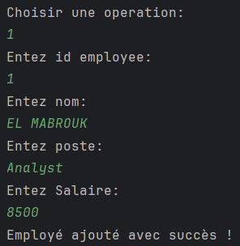
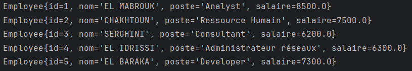
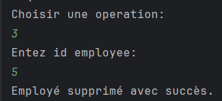
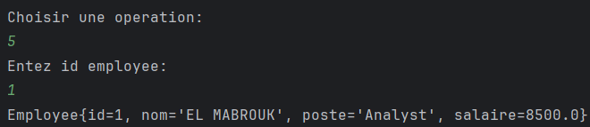
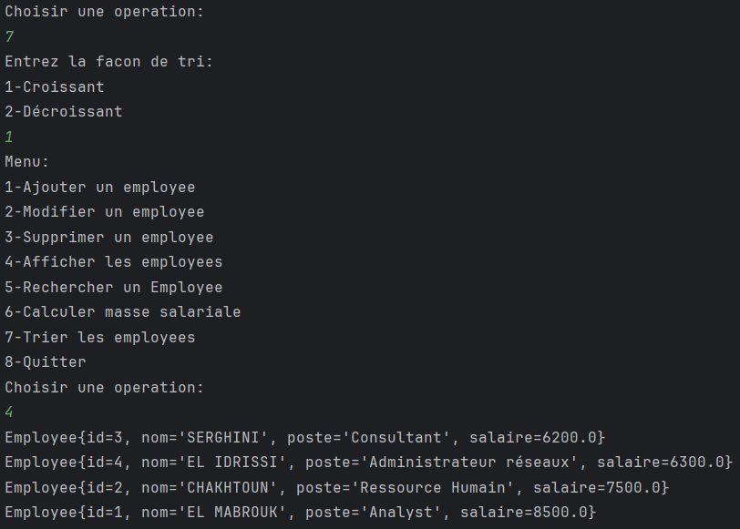
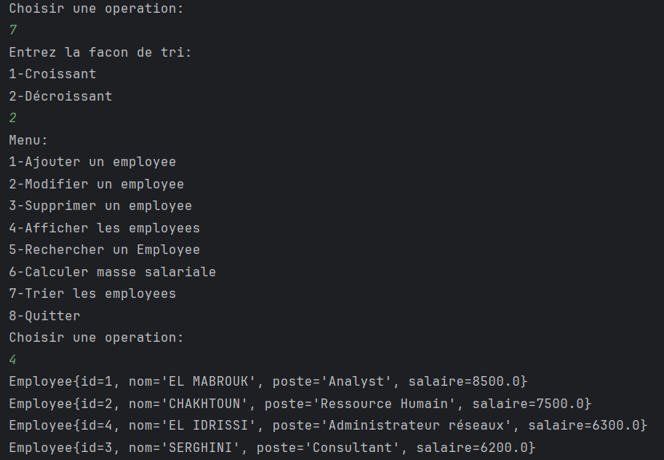
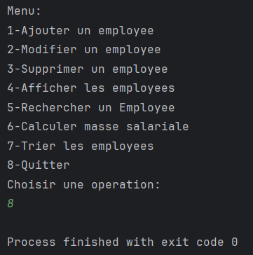

Class Employee.java

Cette classe contient :
- Les attributs privés
- Constructeur avec tous les attributs et constructeur vide.
- Getters et Setters
- Methode ToString() redéfinit pour l'affichage des employees
- Methode de comparaison des employees par leur salaire :
  La méthode est statique, donc elle appartient à la classe elle-même, et non à une instance de la classe.
  Double.compare() : compare deux valeurs de types double et retourne :
    ZÉRO si les salaires sont égaux.
    Un nombre négatif si le salaire de e1 est inférieur à celui de e2.
    Un nombre positif si le salaire de e1 est supérieur à celui de e2.

Classe GestionEmployees.java

Cette classe contient :

- Les attributs privés :
    employees : un tableau d'objets Employee qui stocke les employés.
    nbEmployees : un entier qui garde le compte du nombre d'employés enregistrés.
    MAX_EMPLOYEES : une constante qui définit la capacité maximale du tableau d'employés (ici, elle est fixée à 5 pour les tests).
Constructeur :

  - Le constructeur par défaut initialise le tableau des employés avec la taille définie par MAX_EMPLOYEES et met le nombre d'employés à 0.
    - Méthodes :

        printMenu() : Affiche un menu interactif pour que l'utilisateur puisse choisir une opération à effectuer sur les employés (ajout, modification, suppression, affichage, recherche, calcul de la masse salariale, triage, ou quitter).

        ajouterEmployee(Employee e) : Ajoute un nouvel employé au tableau, en vérifiant d'abord que l'ID de l'employé n'est pas déjà présent.

        modifierEmployee(int id, String nouveauNom, String nouveauPoste, double nouveauSalaire) : Modifie les informations d'un employé existant basé sur son ID.

        supprimerEmployee(int id) : Supprime un employé du tableau en décalant les autres éléments pour ne pas laisser de trous dans le tableau.

        afficherEmployees() : Affiche tous les employés présents dans le tableau.

        rechercherEmployees(int id) : Recherche un employé par son ID et l'affiche si trouvé.

        calculerMasseSalariale() : Calcule et retourne la somme totale des salaires de tous les employés enregistrés.

        trierEmployeesParSalaire(boolean ordreCroissant) : Trie les employés par salaire, soit en ordre croissant soit décroissant, selon le paramètre passé:
  
        Arrays.sort() :

          La méthode utilise la fonction Arrays.sort() de Java pour trier un tableau. Cette méthode trie un tableau en utilisant l'algorithme de tri natif de Java (généralement un tri par fusion ou un tri rapide).
          Premier paramètre (employees) : Le tableau des employés que nous souhaitons trier.
          Deuxième paramètre (0) : L'index de départ (ici, nous commençons à l'index 0, c'est-à-dire du début du tableau).
          Troisième paramètre (nbEmployees) : L'index de fin du tri (nous trions jusqu'au nombre actuel d'employés, donc nbEmployees).
          Quatrième paramètre : Un comportement personnalisé de comparaison défini par un Comparator lambda (e1, e2) -> ....
        
        Comparator lambda (e1, e2) -> ... :

            Ce lambda permet de définir comment les employés doivent être comparés pour déterminer leur ordre.
            Si ordreCroissant est vrai, cela appelle la méthode compareParSalaire(e1, e2) de la classe Employee pour comparer les salaires des employés en ordre croissant.
            Si ordreCroissant est faux, alors les employés sont comparés en ordre décroissant en inversant les paramètres de la méthode compareParSalaire (Employee.compareParSalaire(e2, e1)).

        Méthode main(String[] args) : La méthode principale qui crée une instance de GestionEmployees et affiche le menu.

Testing:

1- Menu principal :

2- Operation d'ajout :

3- Ajout d'un ID double :

4- Tableau plein :

5- Affichage avant MAJ et suppression :

6- Mise à jour :

7- Mise à jour d'un employee inexistant :

8- Suppression :

9- Affichage à nouveau :

10- Recherche par ID :

11- Recherche par ID inexistant :

12- Calcul de masse salariale :

13- Triage croissant :

14- Triage decroissant :

15- Arrete du programme :

